# pcDuino Robot

## 介绍  
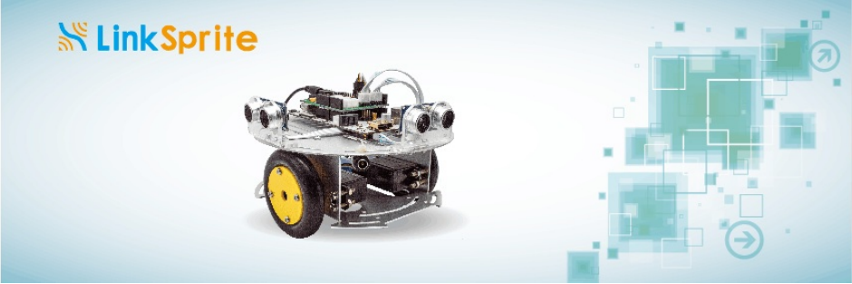
pcDuino Robot是一款基于[ASU VIPLE](http://venus.eas.asu.edu/WSRepository/VIPLE/)图形编程工具的机器人。用户需要用ASU VIPLE工具进行图像化编程，再通过WiFi远程控制pcDuino Robot，实现机器人的前进、后退、转外等动作，也可以实现自动避障、走迷宫等功能。板载功能强大的迷你PC——[pcDuino 3B](http://www.linksprite.com/linksprite-pcduino3/)，内装Ubuntu 12.04系统。系统启动后会自动建一个WiFi热点，远端的PC通过该热点，用VNC或者SSH工具远程访问系统。Robot⻋架采用合金工艺，电机采用的是360度连续舵机，同时在电源驱动板上提供了丰富扩展接口，方便用户扩展其他外围设备。

## 硬件规格
- pcDuino3B
	- 全志A20 双核ARM Cortex A7
	- 1GB内存
	- 8G SD卡
	- 板载WiFi芯片
- 电源驱动板  
- 超声波传感器 HC-RS04 x 2  
- 360度连续舵机 x 2  
- 7.4V 18650锂电池
- 小车车架 

## 软件规格
* Robot系统
	* Ubuntu 12.04
* 编程工具
	* ASU VIPLE程序，支持Win7以上的系统

## 特点
* 支持ASU VIPLE图形化编程
* 支持WiFi AP模式通信
* 可实现小车避障、走迷宫等

## 使用教程

### 1. 安装ASU VIPLE工具
ASU VIPLE采用与Microsoft VPL一样的计算模型，程序可以运行在Windows的计算机上。计算机发送命令控制给机器人，又可以接收来自机器人的传感器数据。PC与机器人之间传递的数据采用JSON格式。可以支持WiFi、蓝牙或者USB通信等。

需要一台PC，自带无线网卡（因为要跟pcDuino Robot进行WiFi通信）。系统要求Win7或更高版本，点击这里下载[ASU VIPLE工具](https://s3.amazonaws.com/linksprite/robot/viple/ASP-VIPLE-3.2.2.zip)，下载完成后，解压缩后运行VIPLE.exe即可。
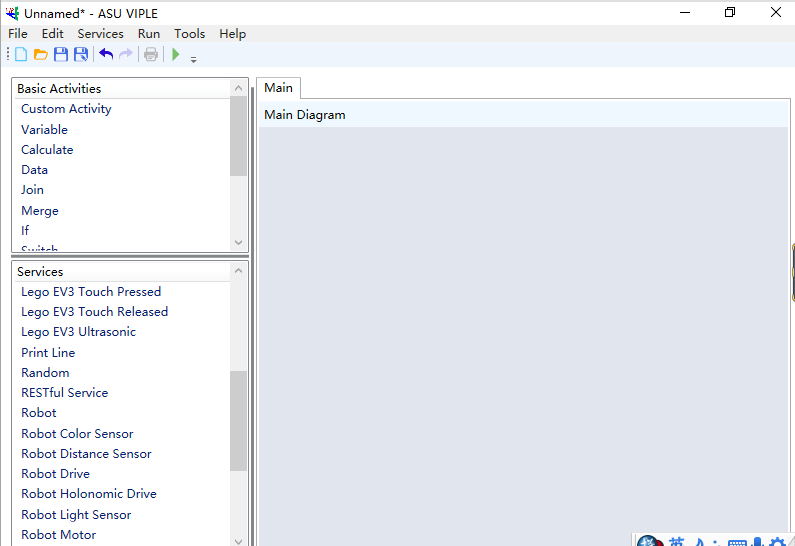
ASU VIPLE编程与微软的VPL编程类似，左侧栏中提供图像编程的元素：
1. Basic Activities
提供了基本的编程元素，包括数据、变量、if/else、while、Join、Merge的编程模块
2. Services
提供了跟Robot等通信的服务模块。

### 2. ASU VIPLE入门
**Hello World**
* 打开ASU VIPLE工具
* 快捷键**Ctrl+ N** 或者点击菜单栏**File --> New**,创建新工程
* 从Basic Activities栏中拖出**Data**模块
* 在Data模块中输入：**Hello world！**
* 从Services栏中拖出**Print Line**模块
* 将两个模块前后相连
* 点击工具栏中的**运行**按钮,或者按F5键，运行

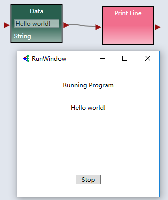

**基本的输入和输出**
* 重新创建一个工程
* 从左侧的Basic Activities栏中拖出**Calculate**模块
* 从左侧的Services栏中拖出**Simple Dialog**模块
* 按照如下图设置和连接模块
* 按F5键运行程序
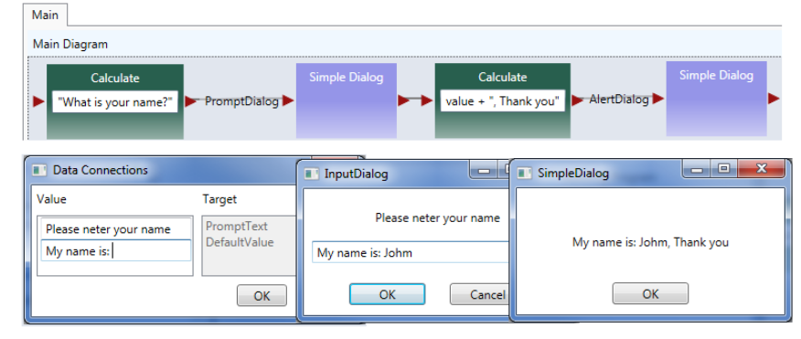

**简单的计数器**
* 根据下图连接和设置模块
* 按F5键运行程序

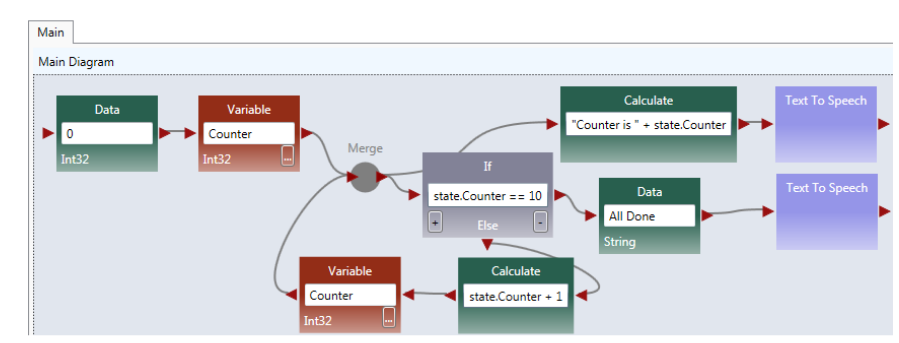

更多ASU VIPLE编程，请参考：**[VIPLE编程指导手册](https://s3.amazonaws.com/linksprite/robot/viple/IntroductionVIPLE.pdf)**

### 3. 远程控制机器人入门

#### pcDuino Robot配置信息

pcDuino Robot启动后，系统会自动创建一个WIFI热点，基本的信息如下：
* 热点名称：**pcDuino-xxxx**
* 密码：**12345678**
* IP地址：**10.0.0.1**
* 对应VIPLE的服务端口号：**8124**

接下来将介绍VIPLE如何连接pcDuino Robot。

* 打开pcDuino Robot的电源开关，待WiFi模块的灯亮起
* PC上打开网络连接，搜索以**“pcDuino-”**开头的热点
* 选中并输入WiFi密码，等待连接成功

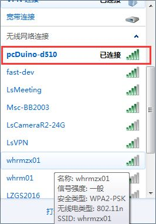

* Robot模块的配置信息，用于配置基本的通信信息
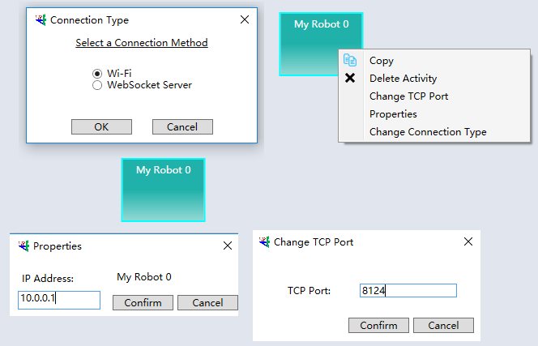

* Robot Drive模块配置信息，用于配置舵机
	* 两路舵机的设备号是0和1
	* 控制车速的范围在-1.0到1.0之间 	
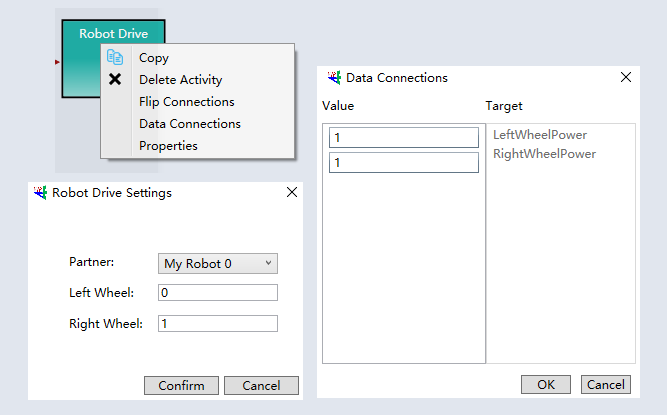

* Robot Distance Sensor模块配置信息，用于配置超声波传感器
	* 超声波传感器的设备号是0和1

具体的测试程序，可以参考[github测试程序](https://github.com/YaoQ/pcDuinoRobot)。

#### a. 舵机控制测试 
* 打开ASU VIPLE程序
* 打开**servo-control.xml**工程测试 
* 确保PC连上了pcDuino Robot的WiFi  
* 点击VIPLE程序的中的运行按钮，并按方向键进行小车的控制  

VIPLE代码如下图所示：  

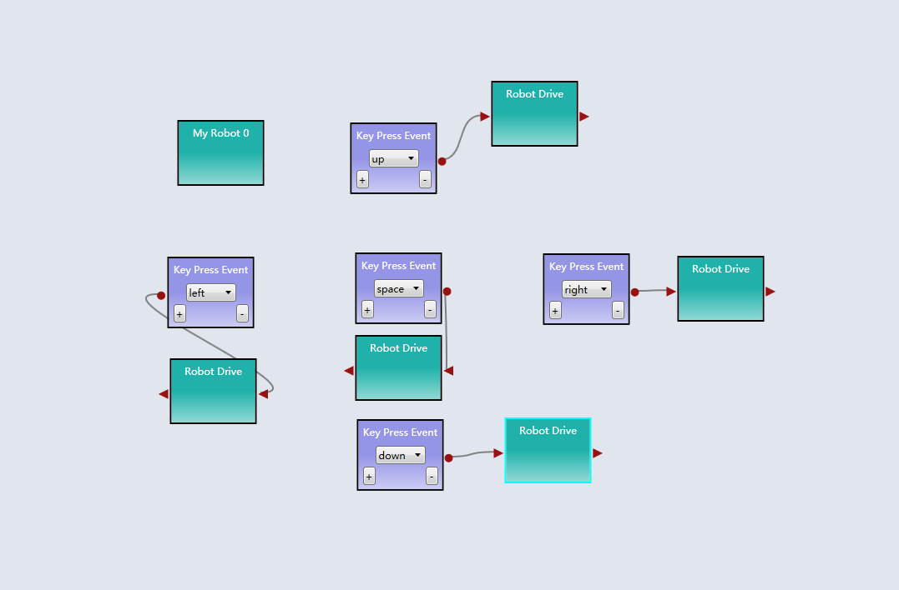  

#### b. 超声波传感器测试
* 运行**ultrasonic.xml**
* 观察在窗口显示的数据
* 手动添加障碍物观察距离的变化  

VIPLE代码如下图所示：  
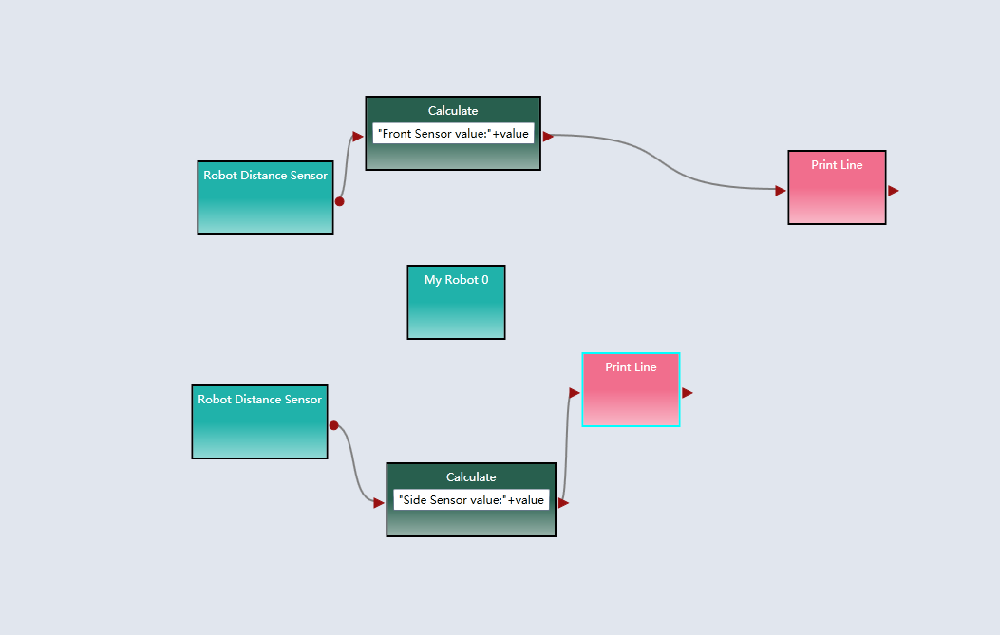   

#### c. pcDuino Robot走迷宫
* 运行**maze-resolove.xml**
* 观察pcDuino Robot走迷宫，并对相应的参数进行修改
注意：**此工程采用靠右走算法实现**

VIPLE代码如下图所示：  
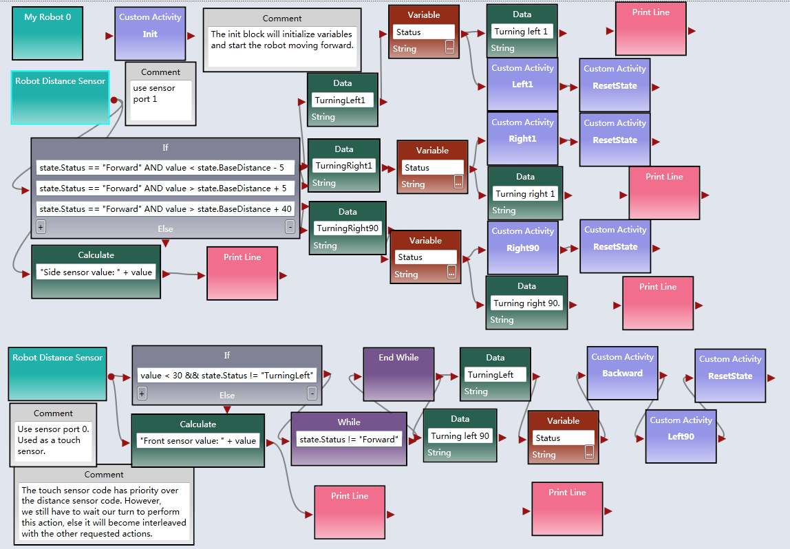 

## Android APP控制小车
我们开发了一个简易的APP，专门用于测试小车的基本功能。
1. 下载并安装[APP](https://github.com/YaoQ/pcDuinoRobot/tree/master/APP)
2. 启动小车，并找到小车所创建的热点：**pcDuino-xxxx**
3. 手机连接该WiFi热点

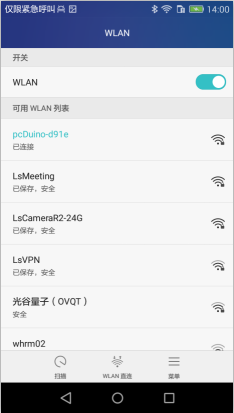
4. 通过APP读取超声波传感器的数据，并可以控制小车的运行

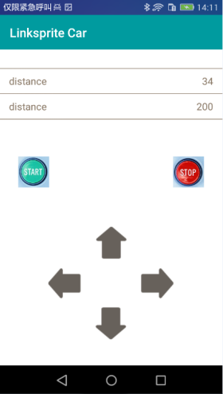

## 资源下载
1. [ASU Viple程序](https://s3.amazonaws.com/linksprite/robot/viple/ASP-VIPLE-3.2.2.zip)
2. [VIPLE 参考程序](https://github.com/YaoQ/pcDuinoRobot)
3. [VIPLE编程指导手册](https://s3.amazonaws.com/linksprite/robot/viple/IntroductionVIPLE.pdf)
