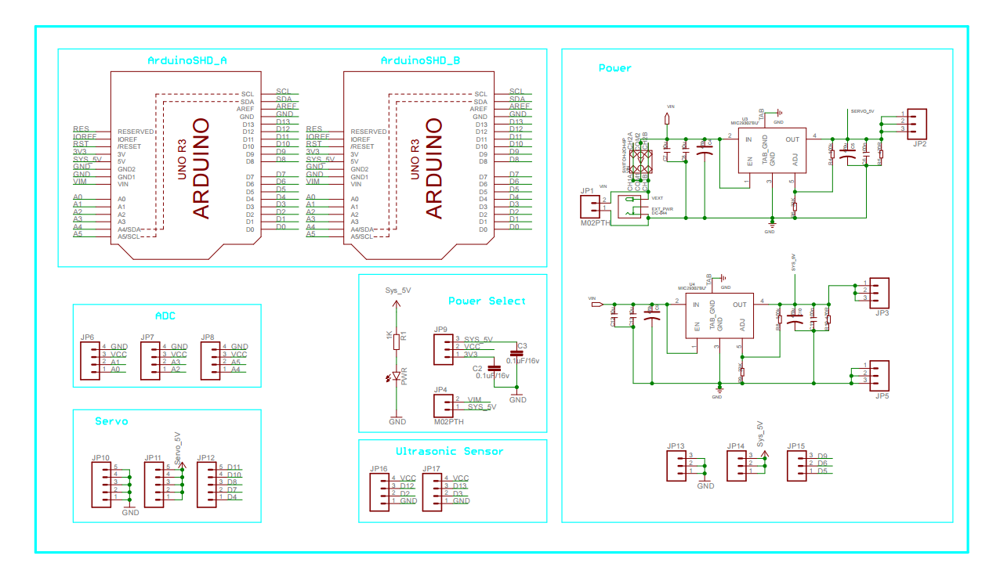

## 介绍  

pcDuino Robot是个基于ASU VIPLE图形编程具的智能教学机器设备，板载强的miniPC平台PcDuino 3B，pcDuino Robot具有距离检测、触摸检测、速度控制等功能。pcDuino Robot由两个部分组成，一个是pcDuino 3B开发板，pcDuino 3B是一种高性能，搞性价比的迷你PC的平台，能够运行PC操作系统，如Ubuntu和Android的ICS等。它可以通过内置HDMI接口输出视频到电视或显示器屏幕。pcDuino3B的硬件性能指标远超树莓派，性能稳定，做工精良。pcDuino3B迷你计算机的CPU采用1GHz ARM Cortex A7内核，DRAM为1GB，板载存储 达到 4GB Flash,完全兼容Arduino接口。另外，pcDuino可以从NAND或者 从mini-SD卡(TF卡)启动，在NAND Flash内有出厂预装了ubuntu系统，您拿到手即可使用
## 特点  
Power Base shield : 7-12V DC input  
HC-RS04 x 2  
Servo x 2  
Lithium-ion battery x 1  
CPU: Allwinner A20.1GHz ARM Cortex A7 Dual Core  
GPU: OpenGL ES2.0, OpenVG 1.1, Mali 400 Dual Core  
DRAM: 1GB  
Storage: 4GB Flash, microSD card (TF) slot for up to 32GB, SATA Host  
Video: HDMI  
OS Support:Lbuntu 12.04、Android  
Extension Interface:Arduino (TM) Headers  
NetworkInterface:10/100/1G Mbps RJ45、WIFI  
Power:5V, 2000mA  
## Power Base Shield原理图  

## 使用教程  
pcDuino Robot与PC的连接是通过WIFI AP，IP地址为10.0.0.1，端口号为8124，下面的测试例程所有的连接配置均已经配置好，如若自己写代码则需要自己手动实行一下连接的IP和端口号，两个私服电机分别对应的设备号为0和1，车速的范围为-1~1，距离传感器的设备号也是0和1.  
测试程序以及PC端VIPLE程序获取链接：https://github.com/delongqilinksprite/pcDuinoRobot.git
#### pcDuino Robot的控制  
* 获取PC程序ASU VIPLE并安装  
* 启动小车，并在PC端按照小车上面wifi的SSID和密码进行连接  
* 打开Servo_control.xml代码进行测试  
* 点击VIPLE程序的中的运行按钮，并按方向键进行小车的控制  
VIPLE代码如下图所示：  
  
#### 距离测试
* 打开ASU VIPLE程序
* 在VIPLE中打开Ultrasonic.xml程序  
* 启动小车，并在PC端按照小车上面wifi的SSID和密码进行连接
* 点击VIPLE程序的中的运行按钮，在窗口中观看距离
* 手动添加障碍物观察距离的变化  
VIPLE代码如下图所示：  
   
#### pcDuino Robot走迷宫
* 打开ASU VIPLE程序
* 在VIPLE中打开MyProgram.xml程序  
* 启动小车，并在PC端按照小车上面wifi的SSID和密码进行连接
* 点击VIPLE程序的中的运行按钮，将小车放进迷宫
* 观察pcDuino Robot走迷宫，并对相应的参数进行修改  
VIPLE代码如下图所示：  
 