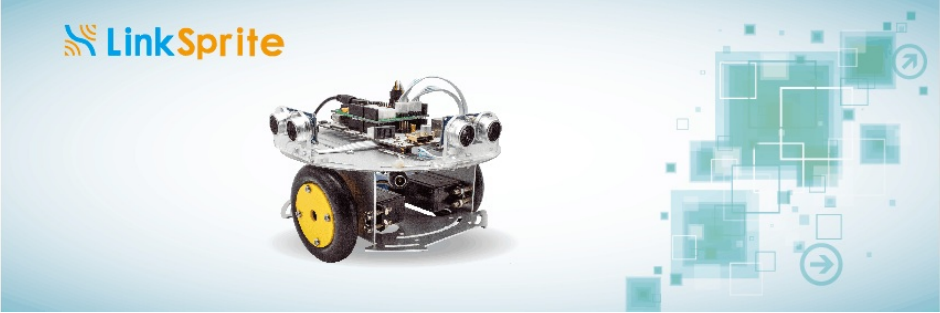

# pcDuino Robot

## Introduction  

pcDuino Robot is a programmable Robot which supports [ASU VIPLE](http://venus.eas.asu.edu/WSRepository/VIPLE/) graphical programming. We can use ASU VIPLE tool to remotely program the robot via WiFi. It is powered by pcDuino3B and runs Ubuntu 12.04 OS. And also it is easy to remotely access system via VNC or ssh. We can drive the robot forward, backward or turn it around. There are two ultrasonic sensors on the robot which are used to get relative distance from itself to the obstacles. So we can use different algorithm to control the robot, and let it find out way of a maze. 

## Hardware specifications
- pcDuino3B
	- Allwinner A20 Dual-core ARM Cortex A7
	- 1GB RAM
	- 8G SD flash
	- Onboard WiFi module
	- Arduino-comptiable slot
- Power shield for driving pcDuino3B and servo motor
- Ultrasonic sensor HC-RS04 x 2  
- high quality continuous rotation servo motor (5V DC)x 2  
- 7.4V 18650 lithium battery
- 8.4V battery charger
- Aluminium robot platform

## Software specifications
* OS on Robot
	* Ubuntu 12.04
* Programming tool
	* ASU VIPLE program supporting Win7 or later
	
## Features
* Robot supporting ASU VIPLE graphical programming
* WiFi control
* Maze algorithm implementation
